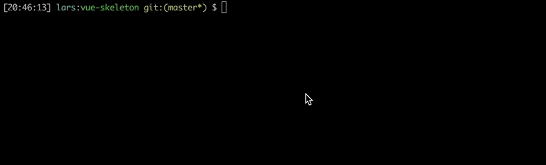

# Creating a component
Note: All examples below are based on the [vue-skeleton](https://github.com/hjeti/vue-skeleton) by [hjeti](https://github.com/hjeti/). But it should work for all vue components.

The main functionality of this module is to create transition components. Since everything in Vue is a component you can easily create page transitions as well. In this section we will talk about how to create your first transition component manually and generate one with the provided templates using the [seng-generator](http://github.com/mediamonks/seng-generator).

## Manual creation

### Folder structure

```
/components
├── [ComponentName]/
│   └── index.js
│   └── [ComponentName].vue
│   └── [ComponentName].js
│   └── [ComponentName].scss
│   └── [ComponentName]TransitionController.ts
└── ...
```

For demonstration purpose we will create a new component called DummyComponent.


### DummyComponent.vue
The *.vue file does not require any modification.

### DummyComponent.js
HandleAllComponentsReady is triggered when all the child components are 'ready'. Therefore we can create the DummyComponentTransition and be sure that all the child components are initialised.

```javascript
import AbstractTransitionComponent from 'vue-transition-component';
import DummyComponentTransition from 'component/DummyComponent/DummyComponentTransition';

export default {
  name: 'DummyComponent',
  extends: AbstractTransitionComponent,
  methods: {
    handleAllComponentsReady() {
      this.transitionController = new DummyComponentTransition(this);
      this.isReady();
    },
  },
};
```

**Note**: *Vue.js will overwrite your methods so be aware of overwriting the following methods:*
* isReady
* handleAllComponentsReady
* updateRegistrableComponent
* transitionIn
* transitionOut
* startLoopingAnimation
* stopLoopingAnimation
* checkComponentsReady
* componentReady

### DummyComponentTransitionController.ts
This file will contain all the transitions for your page, you can add tweens to the [provided greensock timelines](https://greensock.com/docs/#/HTML5/GSAP/TimelineMax/). Also it allows you to nest timelines, clone timelines create multiple timelines for your components.

**Note**: *Full documentation on this file can be found at the [transition-controller](https://github.com/larsvanbraam/transition-controller) module page.*

### index.js
The index.js file just imports the main javascript file so you can easily import it!

```javascript
import DummyComponent from './DummyComponent';

export default DummyComponent;
```

## Automated creation
If If you followed the instructions in the setup the seng-generator section you will be able to run the following command and follow the steps to generate a new component.

```bash
$ sg wizard
```



## Rendering the component
Using transition components is the same as using any other component in Vue.js. Just register the component and then add it to your template. You can use the refs to access the reference from your parent component and call the transition methods as described in the [TypeDoc](https://larsvanbraam.github.io/vue-transition-component/docs/typedoc)

```html
<DummyComponent ref=dummyComponent/>
```

### For example:

```javascript
...
const {dummyComponent} = this.$refs;

dummyComponent.transitionIn().then(() => dummyComponent.transitionOut());
...
```

```javascript
...
const {dummyComponent} = this.$refs;

dummyComponent.startLoopingAnimation();
dummyComponent.stopLoopingAnimation();
...
```


