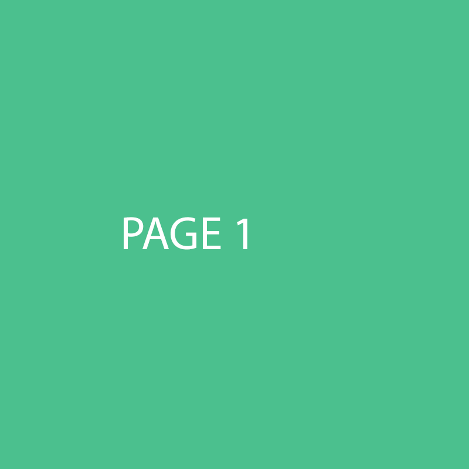
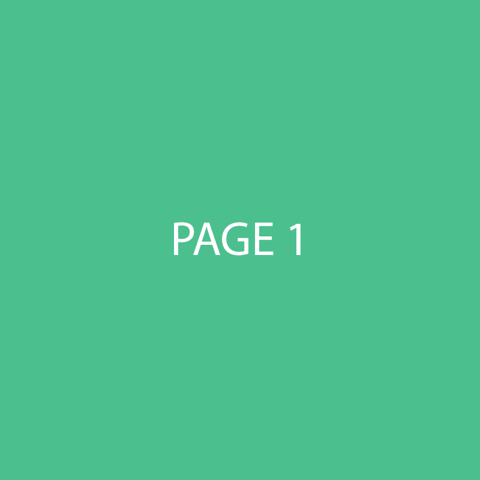

# Page Flows
The page flow is set in the `beforeCreate` method of the `PageTransitionComponent`. All pages have a normal flow by default. You can change the flow for a page by overwriting the this.flow.

```javascript
import { FlowType } from 'vue-transition-component'
...
created() {
  this.flow = FlowType.NORMAL
},
...
```

## Normal flows
By default all pages have a normal flow, this can be seen like this:



1. Transition out triggered
2. Wait for transition out to be complete
3. Destroy old page
4. Change the route
5. Create new page
6. Transition in new page

## Cross flows
In a cross flow the transition out of the current page and the transition in of the new page occur at the same time.



1. Transition out old page triggered
2. Destroy old page
3. Change the route
4. Create new page
5. Transition in new page
